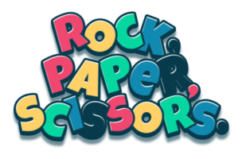
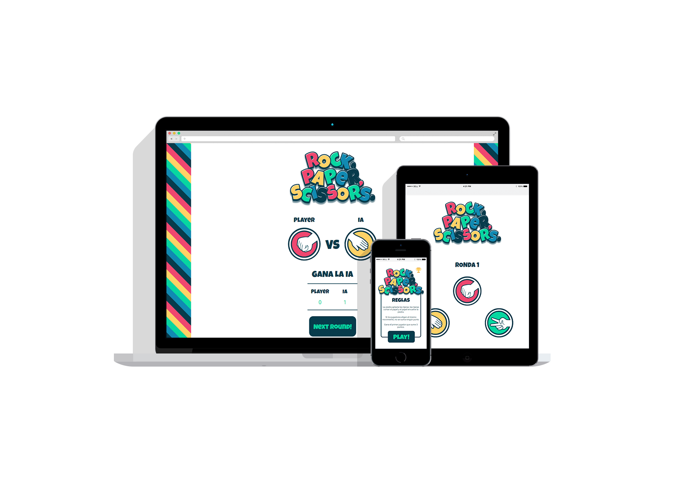

Basado en el clásico juego de manos "Piedra, Papel o Tijeras". 🌑 📃 ✂️

Con una interfaz de usuario sencilla, en la que podrás hacer click sobre el icono y seleccionar así tu opción.

La piedra aplasta las tijeras, las tijeras cortan el papel y el papel envuelve la piedra.

¿Conseguirás ganar a tu oponente? ¡Descúbrelo!

🚨🚧🚧 EN CONSTRUCCIÓN 🚧🚧🚨

- [ ] Tabla de puntuaciones

## Tecnologías utilizadas

 &nbsp;&nbsp;&nbsp;
 &nbsp;&nbsp;&nbsp;

